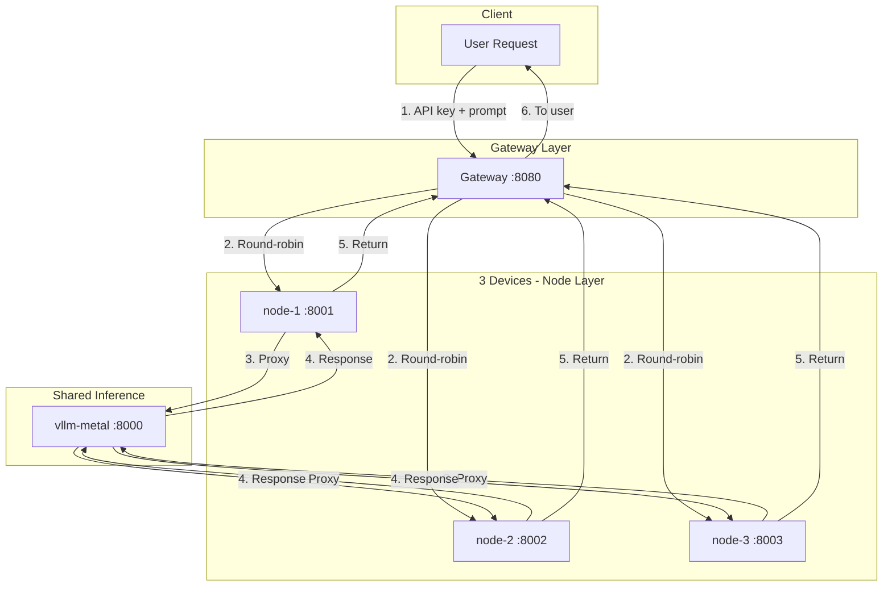

# DecentralizedLLM

**One LLM. Three devices. Distributed inference.**

A proof-of-concept that demonstrates how a single LLM can be split across multiple nodes—simulating a decentralized inference network where requests are distributed, nodes can fail independently, and the system keeps running.

---

## What is Decentralized LLM?

Instead of one monolithic server handling all inference, a **decentralized LLM** spreads the workload across multiple nodes. Each node can serve requests independently. If one goes down, others take over. No single point of failure.

This project simulates that architecture: one shared model (vLLM on your Mac) behind **3 proxy nodes** that distribute incoming requests. The gateway routes traffic round-robin across nodes and uses a circuit breaker to skip unhealthy ones.

---

## How One LLM Becomes Three Devices

```
                    ┌─────────────────────────────────────────────────────────┐
                    │                    YOUR REQUEST                          │
                    └─────────────────────────────┬───────────────────────────┘
                                                  │
                    ┌─────────────────────────────▼─────────────────────────────┐
                    │  GATEWAY (Traffic Controller)                             │
                    │  • Validates API keys                                      │
                    │  • Round-robin: Request 1→Node1, 2→Node2, 3→Node3, 4→Node1 │
                    │  • Circuit breaker: Skips nodes that fail repeatedly       │
                    └─────────────────────────────┬─────────────────────────────┘
                                                  │
         ┌────────────────────┬───────────────────┼───────────────────┬────────────────────┐
         │                    │                   │                   │                    │
         ▼                    ▼                   ▼                   │                    │
┌─────────────────┐  ┌─────────────────┐  ┌─────────────────┐       │                    │
│  DEVICE 1       │  │  DEVICE 2       │  │  DEVICE 3       │       │                    │
│  node-1 :8001   │  │  node-2 :8002   │  │  node-3 :8003   │       │                    │
│  Proxy → vLLM   │  │  Proxy → vLLM   │  │  Proxy → vLLM   │       │                    │
└────────┬────────┘  └────────┬────────┘  └────────┬────────┘       │                    │
         │                    │                    │                 │                    │
         └────────────────────┴────────────────────┘                 │                    │
                                  │                                   │                    │
                    ┌─────────────▼─────────────┐                     │                    │
                    │  SHARED INFERENCE ENGINE  │                     │                    │
                    │  vllm-metal (Host :8000)  │◄────────────────────┴────────────────────┘
                    │  One model, Metal GPU     │      Prometheus + Grafana (observability)
                    └──────────────────────────┘
```

**The split:** Each of the 3 nodes is an independent container. The gateway sends Request 1 to Node 1, Request 2 to Node 2, Request 3 to Node 3, then cycles back. If Node 2 fails, the gateway routes only to Node 1 and Node 3. The actual model runs once on the host; the *distribution* happens at the request level.

---

## What is the Gateway?

The **Gateway** is the single entry point for all clients. It sits in front of the 3 nodes and:

| Role | What it does |
|------|--------------|
| **Traffic controller** | Receives every request, forwards it to one of the 3 nodes (round-robin) |
| **API key guard** | Rejects requests without a valid `x-api-key` header |
| **Circuit breaker** | If a node fails N times in a row, it stops sending traffic there for a cooldown period |
| **Health checker** | Before forwarding, pings the node’s `/health`; skips unhealthy nodes |

Without the gateway, clients would talk directly to one node. With it, they get load balancing, security, and automatic failover.

---

## Request Flow (Mermaid)



---

## What I Implemented

| Component | Implementation |
|-----------|----------------|
| **3 nodes** | FastAPI containers that proxy to vLLM; each has `/health` and `/metrics` |
| **Gateway** | FastAPI with API key validation, round-robin load balancing, circuit breaker |
| **Inference** | vllm-metal on host (Apple Silicon Metal GPU) |
| **Observability** | Prometheus scrapes all nodes + gateway + vLLM; Grafana dashboard |
| **Public access** | Cloudflare Tunnel for HTTPS |

---

## Quick Start

### 1. Start vLLM (Terminal 1)

```bash
source ~/.venv-vllm-metal/bin/activate
vllm serve mlx-community/Qwen2.5-0.5B-Instruct-8bit --port 8000 --host 0.0.0.0
```

### 2. Start the stack (Terminal 2)

```bash
cd /Users/srpillai/CODING/DecentralizedLLM
docker compose up -d
```

### 3. Test

```bash
curl -s http://localhost:8080/health | jq .
curl -s -X POST http://localhost:8080/v1/chat/completions \
  -H "Content-Type: application/json" \
  -H "x-api-key: sridhar-intern-2026" \
  -d '{"model":"mlx-community/Qwen2.5-0.5B-Instruct-8bit","messages":[{"role":"user","content":"Hi"}],"max_tokens":32}' \
  | jq '.choices[0].message.content'
```

---

## UI Access

| Service | URL | How to access |
|---------|-----|---------------|
| **Grafana** | http://localhost:3000 | Login: `admin` / `admin` → Dashboards → DecentralizedLLM Dashboard |
| **Prometheus** | http://localhost:9090 | Status → Targets (no login) |
| **Gateway** | http://localhost:8080 | API endpoint; use `x-api-key: sridhar-intern-2026` |

---

## Public Access

```bash
cloudflared tunnel --url http://localhost:8080
```

Use the returned `*.trycloudflare.com` URL for HTTPS.

---

## Troubleshooting

| Issue | Fix |
|-------|-----|
| Node returns 503 | Ensure vllm-metal is running on host:8000 |
| Gateway 503 "All nodes unavailable" | Check `docker compose ps`; ensure vLLM is up |
| Grafana "No data" | Wait 1–2 min; check Prometheus targets |
| Model not found | `curl -s http://localhost:8000/v1/models | jq .` to see loaded model |
